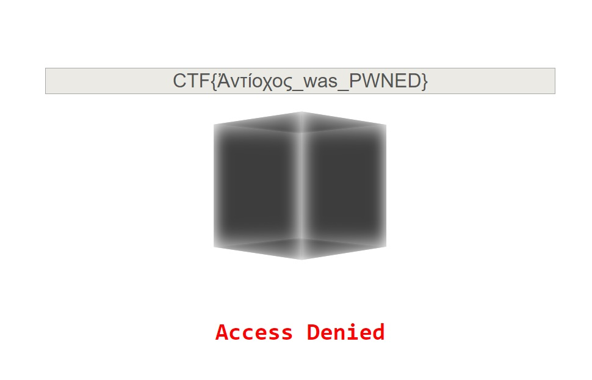
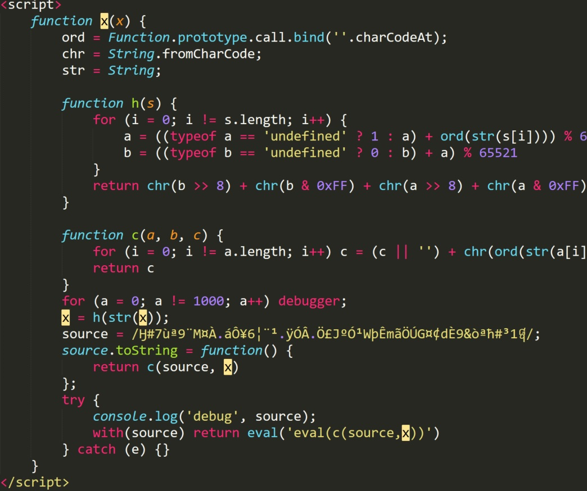
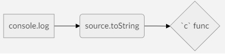
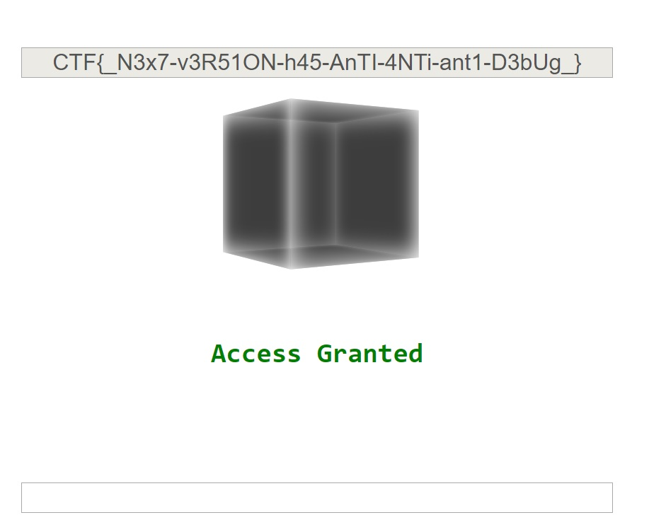

# JS SAFE 2.0

This VERY COOL task was part of the 'WEB' category at the 2018 Google CTF Quals round (during 23-24 June 2018).

It was solved by [NotWearingPants](https://github.com/NotWearingPants) and [XD-DRAGON](https://github.com/xddragon4), in [The Maccabees](https://ctftime.org/team/60231) team


## The challenge

In the challenge, we've got an HTML file that can store secrets in the browser's localStorage. To obtain the secrets you've to know the key / passphrase.

 


### CHALLENGE  ACCEPTED

So...diving into the client's side code reveals some html, css and JS code.
Pressing enter after inserting the passphrase executes the `open_safe()`. 

```JS
function open_safe() {
  keyhole.disabled = true;
  password = /^CTF{([0-9a-zA-Z_@!?-]+)}$/.exec(keyhole.value);
  if (!password || !x(password[1])) return document.body.className = 'denied';
  document.body.className = 'granted';
  password = Array.from(password[1]).map(c => c.charCodeAt());
  encrypted = JSON.parse(localStorage.content || '');
  content.value = encrypted.map((c,i) => c ^ password[i % password.length]).map(String.fromCharCode).join('')
}
```

This function extracts our passphrase from the HTML input element. It verify the 'CTF' phrase in the beginning and calling the `x(passphrse)` on it.
**We would like to make our `x(password[1])` to return `True`**

```JS
<script>
function x(х){ord=Function.prototype.call.bind(''.charCodeAt);chr=String.fromCharCode;str=String;function h(s){for(i=0;i!=s.length;i++){a=((typeof a=='undefined'?1:a)+ord(str(s[i])))%65521;b=((typeof b=='undefined'?0:b)+a)%65521}return chr(b>>8)+chr(b&0xFF)+chr(a>>8)+chr(a&0xFF)}function c(a,b,c){for(i=0;i!=a.length;i++)c=(c||'')+chr(ord(str(a[i]))^ord(str(b[i%b.length])));return c}for(a=0;a!=1000;a++)debugger;x=h(str(x));source=/Ӈ#7ùª9¨M¤ŸÀ.áÔ¥6¦¨¹.ÿÓÂ.։£JºÓ¹WþʖmãÖÚG¤
¢dÈ9&òªћ#³­1᧨/;source.toString=function(){return c(source,x)};try{console.log('debug',source);with(source)return eval('eval(c(source,x))')}catch(e){}}
</script>
```
After prettifying the code:
```JS
    function x(х) {
        ord = Function.prototype.call.bind(''.charCodeAt);
        chr = String.fromCharCode;
        str = String;

        function h(s) {
            for (i = 0; i != s.length; i++) {
                a = ((typeof a == 'undefined' ? 1 : a) + ord(str(s[i]))) % 65521;
                b = ((typeof b == 'undefined' ? 0 : b) + a) % 65521
            }
            return chr(b >> 8) + chr(b & 0xFF) + chr(a >> 8) + chr(a & 0xFF)
        }

        function c(a, b, c) {
            for (i = 0; i != a.length; i++) c = (c || '') + chr(ord(str(a[i])) ^ ord(str(b[i % b.length])));
            return c
        }
        for (a = 0; a != 1000; a++) debugger;
        x = h(str(x));
        source = /Ӈ#7ùª9¨M¤ŸÀ.áÔ¥6¦¨¹.ÿÓÂ.։£JºÓ¹WþʖmãÖÚG¤
¢dÈ9&òªћ#³­1᧨/;
        source.toString = function() {
            return c(source, x)
        };
        try {
            console.log('debug', source);
            with(source) return eval('eval(c(source,x))')
        } catch (e) {}
    }
```

As we can see, ``x()``:

 1. Calculates the hash on it's input's string by using the ``h(str)`` function.
 2. Defining a regex object named source
 3. Re-defining ``source``'s ``toString`` function to call ``c(source, x)``
 4. Printing 'debug' and source obj to the console
 5. Calling eval on another eval...oh, this seemed very strange

Through the code, we had some ANTI-DEBUG shit we had to handle with.

### Hashing process
We started by debugging the whole process via Chrome's developers tools. For this purpose, we commented out the for loop that called the *debugger* command:
```JS
for (a = 0; a != 1000; a++) debugger;
```
Now, we could proceed.

It seems that ``h`` function calculates a hash on the input to our function (parameter ``x``).
BUT WAIT!!  Looking in the debugging tools, it seems that it calculates the hash on ``x`` function string. WTFFFF?
After some time, my team member *NotWearingPants* called me and said:

> xddragon, my BRO, put ``x()`` into Sublime and press the function's name.

After doing it, I figured out that the ``x()`` function got a special unicode char which looks like ``x`` ([CYRILLIC SMALL LETTER](https://en.wiktionary.org/wiki/%D1%85)) . 
Google - IT WAS NICE :)


You can see that the seemingly `x` is not marked.

---

**Conclusion:** We are hashing `x` function's string.

---

Now, we copied the ``x`` function, named it ``y`` so the prettify process and commenting the loop (see above) won't ruin the hash on ``x``.

BTW: In this step, I asked my team member [RonXD](https://github.com/RonXD) to come and see the - "allegedly `x`" - trick. He also saw the hash function ``h`` and after a second said:

> mannn, its [adler-32](https://en.wikipedia.org/wiki/Adler-32) hashing. You can see it by the use of 'mod 65521'

Say whattt?? NICE, my crypto hero ;)

### Printing source obj's str to console
So, when the ``console.log`` was being executed, Chrome was freezed. Running this on Node.JS console, on the other hand, didn't stuck.




```JS
source.toString = function() {
            return c(source, x)
        }
console.log('debug', source);        
```
We can see that the first param that was passed to `c` function is `source` object (regex)
Now, it can be seen that the loop stopping condition would never be valid. That's because the comparison of 
`i != a.length` is equivalent to `i != 'undefined'` while `i` is integer, and `a` is regex (it doesn't have `length` property)  
We've got an infinite loop !

To overcome this challenge we could:
 - Remove the printing to the console (after examining `c` function, we figured out that `console.log('debug', source)` is redundant
 - Breaking on `c` and defining `a.length`
 -  Functions' ptrs tricks: 
```js
// Override old console.log to do nothing. 
// Saves the old console so we could use it in our code in 'y' function
var newLog = console.log;
console.log = () => {};
window.console = console;
```
 - Changing the behavior of `source's` `toString()`  (in Node.JS, `source` was passed as String to `c` and that is why it didn't stuck


### Nesting evals ???
We still had to figure our the mystery: *eval of eval*? *ah*?

Another strange thing - *Where, the hell, can we find a validation of our passphrase input?* 

---
*Reminders:* 
 - *CYRILLIC `x` contains our passphrase*
 - *We need to make `x` function return True*
---

In this step, we took a break, drank two gallons on Coke and....
**The Coke helped! We figured out the whole story =]**


Lets examine the eval of eval:
```JS
return eval('eval(c(source,x))')
```
The first `eval` executes the second `eval` which executes the return value of `c(source, x)` (which is a string, as expected to be).

Now, `c(source, x)` will use the *String* that represents the Regex of `source`. That's why we won't have an infinite loop as previous.
[NotWearingPants](https://github.com/NotWearingPants) knew it because he is a JS ninja. 
Me, on the other hand, had to figure it out from the reference [regex_reference](https://developer.mozilla.org/en-US/docs/Web/JavaScript/Reference/Global_Objects/RegExp)

> [`RegExp.prototype.source`](https://developer.mozilla.org/en-US/docs/Web/JavaScript/Reference/Global_Objects/RegExp/source "The source property returns a String containing the source text of the regexp object, and it doesn't contain the two forward slashes on both sides and any flags.")
The text of the pattern.

The regex has a source property which is the str that represents the pattern. That's why `c` function would get `a` to be:

> console.log(source.source);
> output:    
> "Ӈ#7ùª9¨M¤ŸÀ.áÔ¥6¦¨¹.ÿÓÂ.։£JºÓ¹WþʖmãÖÚG¤
¢dÈ9&òªћ#³­1᧨"

So, executing:
```JS
c(source,x)
```
returns:

> "х==c('¢×&�Ê´cʯ¬$¶³´}ÍÈ´T�©Ð8ͳÍ|Ô�÷aÈÐÝ&�¨þJ',h(х))"

**Pay attention, in the beginning it is not `x` it is the [CYRILLIC](https://en.wiktionary.org/wiki/%D1%85) char !!**

So, now will be executed:

```JS
eval("х==c('¢×&�Ê´cʯ¬$¶³´}ÍÈ´T�©Ð8ͳÍ|Ô�÷aÈÐÝ&�¨þJ',h(х))");
```
### Decrypting

Our knowledge:
 1. Our input should match the regex: `[0-9a-zA-Z_@!?-]+`
 2. Our input should be equal to the return value of `c('¢×&�Ê´cʯ¬$¶³´}ÍÈ´T�©Ð8ͳÍ|Ô�÷aÈÐÝ&�¨þJ',h(х))")`
 3. Our input's length should be 39 bytes

Our solution:

 1. `c` gets as input the ciphertext and a hash of our input (CYRILLIC variable).
 2. The hash (`h` function) would return 1 dword.
 3. We can enumerate over those 4 bytes and find a combination that result `c` to return a string that matches `[0-9a-zA-Z_@!?-]+`
 4. We wrote a Python script to evaluate the passphrase:
 
 ```PYTHON
import itertools
import string

# this is approximately `h` in the js code
def modified_adler32(string):
    # this function is equivalent to:  struct.unpack('4B', struct.pack('>I', zlib.adler32(string.encode(), 0x821e0a9a)))
    a = 0x0a9a
    b = 0x821e
    for ch in string:
        a = (a + ord(ch)) % 0xfff1
        b = (b + a) % 0xfff1
    return [b >> 8, b & 0xFF, a >> 8, a & 0xFF]

# this is approximately `c` in the js code
def xor_decrypt(encrypted, key):
    return ''.join(chr(c ^ k) for c, k in zip(encrypted, itertools.cycle(key)))

# this is from the html
ALLOWED_FLAG_CHARS = string.ascii_letters + string.digits + '_-@!?'

# this is from within the `eval` in the js
ENCRYPTED_FLAG = [
    0xa2, 0xd7, 0x26, 0x81,
    0xca, 0xb4, 0x63, 0xca,
    0xaf, 0xac, 0x24, 0xb6,
    0xb3, 0xb4, 0x7d, 0xcd,
    0xc8, 0xb4, 0x54, 0x97,
    0xa9, 0xd0, 0x38, 0xcd,
    0xb3, 0xcd, 0x7c, 0xd4,
    0x9c, 0xf7, 0x61, 0xc8,
    0xd0, 0xdd, 0x26, 0x9b,
    0xa8, 0xfe, 0x4a,
]

# this is from within the `eval` in the js
def check_flag(flag):
    assert all(ch in ALLOWED_FLAG_CHARS for ch in flag)
    return flag == xor_decrypt(ENCRYPTED_FLAG, modified_adler32(flag))


### SOLUTION: ###
if __name__ == '__main__':

    HASH_LENGTH = 4

    hash_bytes_possibilities = [
        [
            byte for byte in range(256) if
            all(chr(e ^ byte) in ALLOWED_FLAG_CHARS for e in ENCRYPTED_FLAG[i::HASH_LENGTH])
        ]
        for i in range(HASH_LENGTH)
    ]

    for possible_hash in itertools.product(*hash_bytes_possibilities):
        possible_flag = xor_decrypt(ENCRYPTED_FLAG, possible_hash)
        if check_flag(possible_flag):
            print(possible_flag)
 ```


## Solution

> CTF{_N3x7-v3R51ON-h45-AnTI-4NTi-ant1-D3bUg\_}


## CHALLENGE  COMPLETED - BAMMMM !!!!


