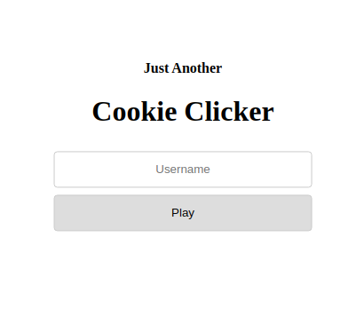
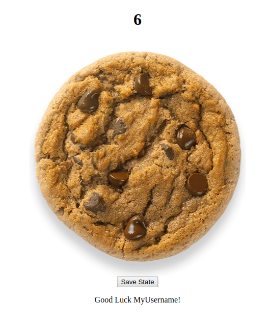
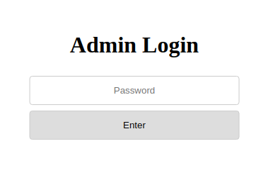
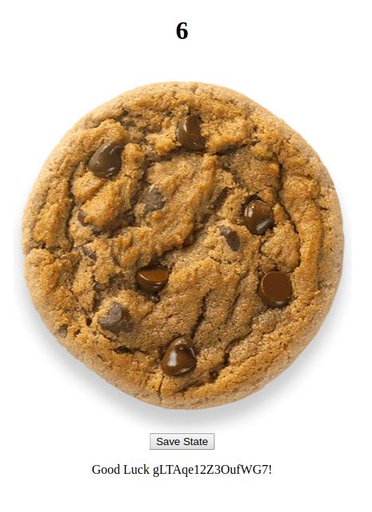
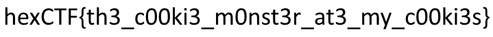

# JACC

This task was part of the 'Web' category at the 2020 Hexion CTF (during 11-13 April 2020).

It was solved [The Maccabees](https://ctftime.org/team/60231) team.


## The challenge

The challenge description:

```
Say hello to JACC - Just Another Cookie Clicker 🍪

http://challenges1.hexionteam.com:2002
```

When browsing to the site, we are prompted to enter our username in order to play:



After entering our username, we are prompted to a page containing a cookie-clicker game, with our username at the bottom.

This game works as follows: every time we click the cookie, the counter at the top of the screen increases by 1. If we hit "Save State", our current counter is saved (so refreshing or exiting the site still leaves the counter at its saved state).



Before diving into the solution, some failed attempts & observations:

1. Saving a state with arbitrary cookie count is easy (we can just `/site?cookies=%d` with any number we want) - it doesn't help in any way.
2. If we try to put some cookie count which is not a number (like `/site?cookies=hello`), the server responds with the error `Error: invalid literal for int() with base 10: 'hello'`. This indicates some python implementation (we know this already because the server is `gunicorn/19.7.1` - gunicorn is a variation of Flask).


## Understanding the cookie

When saving the state of the current cookie counter, we can assume that this information is stored with some web cookie (get the pun?). Indeed, when inspecting the web cookies using a browser, we see that we have one cookie named `seesions`, with its value looks something like that:

```
.eJw1jM1OgzAAgF_F9OyhoB5GsoPNCkgsWOjP6A0oyYBSmBjpWPbuLhrP388VNNM0dO0CAvgIjBsNCK7goQYB4DgNNXaMDonI5ZcVoydbSS51rLpq3FkmCNTQnanUhG-vn9Sfn1v5dskYosrf2YKnSHko5uNpyCG_c4MUNIe7n1AYWo5PsjVzWVihxBYuPFpcKlTJRtfXTEyl0SLD6ybsXEk8e1I0rg6Rrf2__vcPDW5j1BNmJjk0romScxprSjezlht-qcI5JkfUVX3-_u_rJ1XlsFyloLDw0CE7mo70w8oj_f1B93twu_0ArtJd0Q.XptNxA.iZfJAils5Y3VeaC_fBWrx3opaVE
```

Because its structure and because we know this is a Flask application, we can assume this is the **Flask Session Cookie**. A very useful article is ["MITRE CTF 2018 - My Flask App - CTF Writeup"](https://terryvogelsang.tech/MITRECTF2018-my-flask-app/) - a CTF writeup which inspects and fiddles with Flask session cookies.

As we can learn from this great article, the structure of the cookie is:

```
.payload.timestamp.signature
```

- The dot suffix indicates that the payload is compressed using gzip
- The payload is base64 encoded and gzipped
- Then follows the timestamp and the signature, both base64 encoded

In addition, this article assisted us with a python script snippet that allows us to decrypt the cookie content. When decrypting the above cookie, we get the following JSON:

```json
{"cookies":0,"lxml":{" b":"UENFdExTQkJVRWtnVm1WeWMybHZiam9nTVM0d0xqQWdMUzArQ2p4eWIyOTBQZ29nSUNBZ1BHUmhkR0UrQ2lBZ0lDQWdJQ0FnUEhWelpYSnVZVzFsUGsxNVZYTmxjbTVoYldVOEwzVnpaWEp1WVcxbFBnb2dJQ0FnSUNBZ0lEeHBjMTloWkcxcGJqNHdQQzlwYzE5aFpHMXBiajRLSUNBZ0lEd3ZaR0YwWVQ0S1BDOXliMjkwUGdvPQ=="}}
```

The `cookies` field indeed contains the number of cookie we clicked on. The `payload["lxml"][" b"]` is a base64 payload, that if we decode it using base64 **twice**, we get the following XML:

```xml
<!-- API Version: 1.0.0 -->
<root>
    <data>
        <username>MyUsername</username>
        <is_admin>0</is_admin>
    </data>
</root>
```

Before proceeding, one important point to understand here: we can't just edit the cookie content, because it is cryptographically-signed (with the value in the `signature` field in the cookie). Any attempt to change the content of the payload will fail, because the signature won't match. One way to beat it is to somehow leak Flask's `SECRET_KEY` configuration variable, which is used to sign the session cookies (but this is not the solution in this challenge).


## Getting admin privilege

It's easy to see the `<is_admin>0</is_admin>` field in the above XML of the cookie. It only makes sense that this field is verified, and that if the user is indeed an admin - we'll have access to more information / interfaces.

When trivially testing the username we enter, trying to create malformed XML, we can see that our username is not sanitized at all before inserted to this XML. For example, trying to play with a username of `<`, we get a XML parsing error from the site: `Error: StartTag: invalid element name, line 4, column 20 (, line 4)`.

It is clear know that the idea should be injecting a username, that creates an XML which, if parsed, returns 1 for the `is_admin` element. Notice that because we are injecting in the middle of a `username` element, which is inside `data` and `root` elements, we need to somehow ignore the existing `</username>`,` <is_admin>0</is_admin>`, `</data>`, and `</root>`. We can just rely on the fact that if multiple elements with the same name exists, it seems that python's `lxml` parser will just choose the first.

So, we can insert the following username:

```
AdminUser</username> <is_admin>1</is_admin> </data> <data> <username>RegularUser
```

So, the constructed XML after hitting "Play" (which will replace the above `MyUsername` with our injected string) will look like that (spacing for readability):

```xml
<!-- API Version: 1.0.0 -->
<root>
    <data>
        <username>AdminUser</username>
        <is_admin>1</is_admin>
    </data>
    <data>
    	<username>RegularUser</username>
        <is_admin>0</is_admin>
    </data>
</root>
```

And again - because the XML parsing, when the parser parses this XML - it will only take into consideration the first `<data>` element, thus reading the value of `is_admin` element as 1.

Entering this user (which is now admin), we get a different page (no longer the cookie game):



This is not over yet! If we just try to enter some random password, we get `500` ( `Internal Server Error` ) error page.

In the response HTML page, there is a comment:

```html
<!-- If you are an admin and you forgot the password it's located on the server at /admin_pass-->
```

After trying to user `/admin_pass` as a URI (and failing), we understood that this is a path to a file, located on the server. So our goal now is clear: to leak the contents of this file, in order to be able to login as an admin.


## Reading the admin password file (using XXE injection)

Now that our goal is to read a file from the remote server, we tried to leverage our existing primitive (injecting data into the web-cookie XML) in order to do so.

There is a known exploit technique knowns as XXE (XML External Entity) Injection (a lot of resources are available online - I recommend you start with the article [Exploiting XML External Entity (XXE) Injections](https://medium.com/@onehackman/exploiting-xml-external-entity-xxe-injections-b0e3eac388f9)).

This exploit relies on a vulnerability that allows the attacker to control an XML file that is parsed by the server, and leverages advanced feature of XML parsers in order to read remote files from the server, or interact with other entities in an unexpected manner.

Example of an XML file that uses the XXE feature in order to contain a file contents when it's parsed:

```xml
<?xml version=”1.0" encoding=”UTF-8"?>
<!DOCTYPE foo [ <!ENTITY xxe SYSTEM “file:///path/to/file”> ]>
<data>&xxe;</data>
```

When parsing this XML, the `<data>` tag will be filled with the contents of the `/path/to/file` file on the server.

Although this seems promising - we do have control over the XML content - we didn't find any way to leverage the `username` injection into a working XXE injection. This because the main technique to leak file contents using XXE Injection (as we showed here) requires that the `<!DOCTYPE` part will be at the begging of the XML file; but our `username` injection is starting only after a tag has already been opened. In addition, other techniques such as `XInlcude` attacks seem to be disable on this parser.

It seems like we have to find another injection to the XML, that will allow us to control the beginning of the file. Looking back at the original username field, we can see the fields that are sent in the POST request:

```html
<form class="centered" action="login" method="post">
    <div style="text-align: center;"><h4>Just Another</h4><h1>Cookie Clicker</h1></div>
    <input class="good" name="username" placeholder="Username" />
    <input name="version" value="1.0.0" hidden>
    <button class="good" type="submit">Play</button>
</form>
```

One things that pops-up is the `version` field - it cannot be seen in the browser because of the `hidden` attribute, but it sends the value `version=1.0.0` on every POST request.

To refresh our memory, the original XML looks like that:

```xml
<!-- API Version: 1.0.0 -->
<root>
    <data>
        <username>MyUsername</username>
        <is_admin>0</is_admin>
    </data>
</root>
```

When sending `version=2.0.0` instead, we get the following XML:

```xml
<!-- API Version: 2.0.0 -->
<root>
    <data>
        <username>MyUsername</username>
        <is_admin>0</is_admin>
    </data>
</root>
```

Aha! The `version` field seems to be injected in the comment at the start of the XML, and is turns out that without any sanitation as well!

So, in order to leak the contents of the `/admin_pass` file, we will send a request with the following fields (should be URL encoded, of course):

```
version = '1.0.0 --><!DOCTYPE username [ <!ELEMENT username ANY> <!ENTITY xxe SYSTEM "file:///admin_pass">]><!--'
username = '&xxe;'
```

This will create the following XML:

```xml
<!-- API Version: 1.0.0 --><!DOCTYPE username [ <!ELEMENT username ANY> <!ENTITY xxe SYSTEM "file:///admin_pass">]><!-- -->
<root>
    <data>
        <username>&xxe;</username>
        <is_admin>0</is_admin>
    </data>
</root>
```

When this XML is parsed in search for `username` (in order to display "Good Luck" under the cookie), the XML parser will read the contents of the `/admin_pass` file, and insert it inside the `username` tags, resulting in the following page:



This means we successfully leaked the admin password! Which is: `gLTAqe12Z3OufWG7`.


## Finale

After getting the password and logging-in again with the `<is_admin>1</is_admin>` cookie, entering the password shows us the following image:

 

Which means the flag is `hexCTF{th3_c00ki3_m0nst3r_at3_my_c00ki3s}`. Yay!