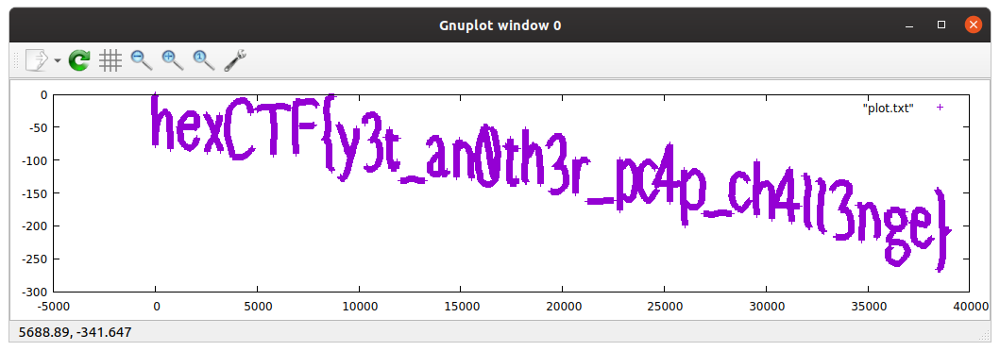
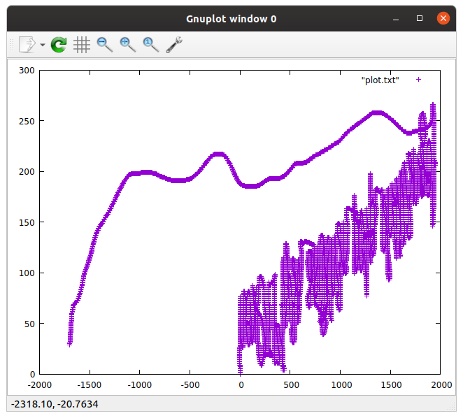

# T&J

This task was part of the 'Misc' category at the 2020 Hexion CTF (during 11-13 April 2020).
It was solved [The Maccabees](https://ctftime.org/team/60231) team.


## The challenge

Description:

```
Can you help Tom catch Jerry?
```

We get a USB recording named `jerry.pcapng`.
It seems like all USB packets, other than `URB_INTERRUPT`, are missing from the pcap.

Each `URB_INTERRUPT` leftover data (the actual data - after the headers) contains exactly 8 bytes. We used `tshark` to extract the leftovers:

```
tshark -r jerry.pcapng -T fields -e usb.capdata > jerry_leftovers.txt
```

This file has a total of 12528 lines. Some of them looks like this:

```
0100000000000000
0100010000000100
0100010000000100
0100010000000100
0100010000000100
01ff0000ffff0000
0100010000000100
0100010000000100
0100010000000100
0100010000000100
...
0000ff000000ffff
00ff0000ffff0000
0000ff000000ffff
0000ff000000ffff
00ff0000ffff0000
00ff0000ffff0000
00ff0000ffff0000
00ff0000ffff0000
0100000000000000
0000000000000000
```

The assumption was that this was a sniff of some keyboard/mouse activity (probably a USB mouse - because the "Tom & Jerry" reference - jerry is a mouse).

When checking out the distribution of each "field" (one of the bytes in index 0-7), we came up with this result:

```
field #0: {'00', '01'}
field #1: {'fc', 'fa', 'f8', 'f9', '03', 'ff', 'fe', '02', 'fd', 'fb', '00', '01'}
field #2: {'00', '01', 'ff'}
field #3: {'00'}
field #4: {'fc', 'fa', 'f8', 'f9', '03', 'ff', 'fe', '02', 'fd', 'fb', '00', '01'}
field #5: {'00', 'ff'}
field #6: {'00', '01', 'ff'}
field #7: {'00', 'ff'}
```


Assuming this was mouse activity, we wanted to paint the mouse movement and understand what is being done with the mouse. We used 2 primary source online:

1. The OS-Dev wiki page [USB Human Interface Devices](https://wiki.osdev.org/USB_Human_Interface_Devices) described the report format of a USB mouse, which theoretically should be only 3 bytes: the first bytes is "button status", the second is "X movement", and the last is "Y movement".
2. A write-up to an old CTF challenge - [Google CTF 2016 – Forensic “For2” Write-up](https://www.rootusers.com/google-ctf-2016-forensic-for2-write-up/) - seems to be very similar, and also helps us to understand how to plot this graph using `gnuplot`.

Given this information, we assumed that the last 5 bytes are just extra information, and the first 3 bytes are indeed the button status, X movement and Y movement. We used this script python to output the information to a file:

```python
#!/usr/bin/env python3
from textwrap import wrap

def convert_to_signed_char(c):
    if c > 127:
        return (256-c) * (-1)
    else:
        return c

# Transform to actual data lines
data_lines = (wrap(line.strip(), 2) for line in open("jerry_leftovers.txt").readlines())
data_packets = []
for l in data_lines:
    data_packets.append([convert_to_signed_char(int(a, 16)) for a in l])

# Remove trailing data
data_packets = data_packets[:-1400]

# Write to file
with open("plot.txt", "w") as f:
    x = 0
    y = 0
    for packet in data_packets:
        x += packet[1] * 20     # Scale-up X-axis
        y -= packet[2]          # Invert Y-axis
        if packet[0] == 1:
            f.write(f"{x} {y}\n")
```

The resulting file looks like that:

```
0 0
0 -1
0 -2
0 -3
0 -4
-20 -4
-20 -5
-20 -6
-20 -7
-20 -8
...
```

Then, we used `gnuplot` to plot the graph:

```bash
$ gnuplot

	G N U P L O T
	Version 5.2 patchlevel 6    last modified 2019-01-01 

	Copyright (C) 1986-1993, 1998, 2004, 2007-2018
	Thomas Williams, Colin Kelley and many others

	gnuplot home:     http://www.gnuplot.info
	faq, bugs, etc:   type "help FAQ"
	immediate help:   type "help"  (plot window: hit 'h')

Terminal type is now 'qt'
gnuplot> plot "plot.txt"
```

And the flag shows up:



So the flag is `hexCTF{y3t_an0th3r_pc4p_ch4ll3nge}`.


## Challenges along the way

The task of plotting the flag was not trivial as described. The original (trivial) plot looked something like this:



The main challenges to make this plot readable were:

### Button status

When we first plotted the data, we didn't take into consideration the "Button Status" (the first byte), and just plotted the X/Y movement. It was clear from the graph that the flag is written there, but it was hard to read (because we plotted everything - and not just when the mouse was pressed).

### X/Y axis

Some modifications should be made to the coordinates to make the graph more readable:

1. We need to scale-up the X-axis (in-code, and also we resizing the plot).
2. We need to invert the Y-axis deltas.

### Trailing data

In the original data, after writing the flag, a long "tail" of data was painted, which made the actual flag hard to read. We simply just removed the last 1400 samples (by trial-and-error) to make sure we stopped plotting after the flag shows up.

