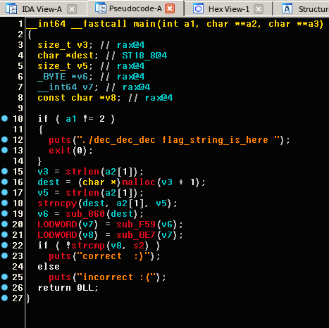
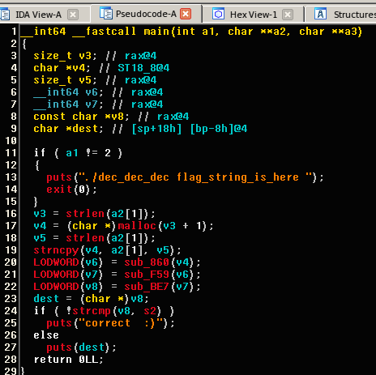

# TokyoWestrens CTF 2018 : dec_dec_dec 99

**Category:** Reversing
**Points:** 99
**Solves:** 159

# Write-up
So we got a binary named dec_dec_dec. A simple ```file``` command indicates it is a x86_64 ELF shared object.

When attempting to run it, it outputs the followings:
```bash
./dec_dec_dec 
./dec_dec_dec flag_string_is_here 
```

Ok, so the binary expects to get the flag as its ```argv[1]```.

running the binary with an argument prints to stdout a failure string.

Trying to ltrace the binary, we saw that the command is not very helpful because it is does not trace any of the library calls:

```bash
ltrace ./dec_dec_dec abcd
incorrect :(
+++ exited (status 0) +++
```

A second look on the binary, indicates it was compiled as full-RELRO and with a BIND-NOW linker attribute. that means it has no plt entries (actually just one for the resolver function). ltrace's main tracing technique is to install breakpoints on plt entries in order to trace dynamic object library calls. therfore running it on our binary seems to fail.

We opened the binary in IDA pro and see a main function that gets our ```argv[1]``` string, and calls 3 other functions.

* the binary passes the string to it's first function
* it then takes the result of the first function with our string as input and passes that to the second function
* it takes the output of the second function with the output of the first function as its input and passes that to the third function

or in other words:
```function3(function2(function1(str)))```

finally the binary compares the result of the third function to the hardcoded string: ```'@25-Q44E233=,>E-M34=,,\$LS5VEQ45)M2S-),7-$/3T ' ``` (using strcmp)



Before reversing each function, we wanted to get an idea of how the output of the function behaves as a result to the input we insert. We patched the failure string argument to puts to be our inserted string, after it was manipulated by the 3 functions. 



Because we know the prefix of each flag is TWCTF{, we inserted this string and saw the prefix of the manipulated string is the same as the prefix of the hardcoded string. Moreover, we saw that the number of the characters matching to the hardcoded string's prefix, coralltes to the number of the right characters in the input string.

```bash
./patched_dec TW
$25-P/0  
./patched_dec TWCT
(25-Q44E./3T 
./patched_dec TWCTF{
(25-Q44E233< 
```

Although we knew brute-forcing a long string with our premetives will not converge, we wrote a simple python script that brute-forces the flag according to the final output of our patched binary. We ran the script and started to reverse the functions.

We decided to start with the second function, as it was the easiest one to reverse. a couple minutes of looking on the code and trying to understand it, indicates it uses a ceasar cipher on its input string.
In this phase we understood that the name of the binary possibly indicated that the flag is the name of the 3 functions we have in the name, and each function is a cipher/encoding function.

In the meantime, our brute-forcing script started to converge towards a string beginning with "ba". as we looked on the first function, we saw it outputs a strings that end with "=". combining it with the fact that the script started to converge to "ba" and a deeper look to the first func's code, we understood the code was a base64 encoding. We verified our assumption by running it against the patched binary and it was right.

As we said earlier, the second func is ceaser ciphear, or in other words - rot 13. trying it on the patch binary showed it was true.
So in this phase we know that the flag is TWCTF{base64_rot13*}.

We started to reverse the third function, all while keeping in mind it should have a cipher/encoding functionallity.
As reversing the code, we could not think of any known functions that match the behaviour of the third and final function.
We decided to patch the binary again, this time to make it take our input, pass it straight to the third func, and write to stdin the result. The patch was very similar to the first patch.
We tried varius inputs to try and see the behavior of the function. Finally, we found out the function was a unix encoding technique called uu - Unix to Unix Encoding. 

```bash
./dec_dec_dec TWCTF{base64_rot13_uu}
correct  :)
```
